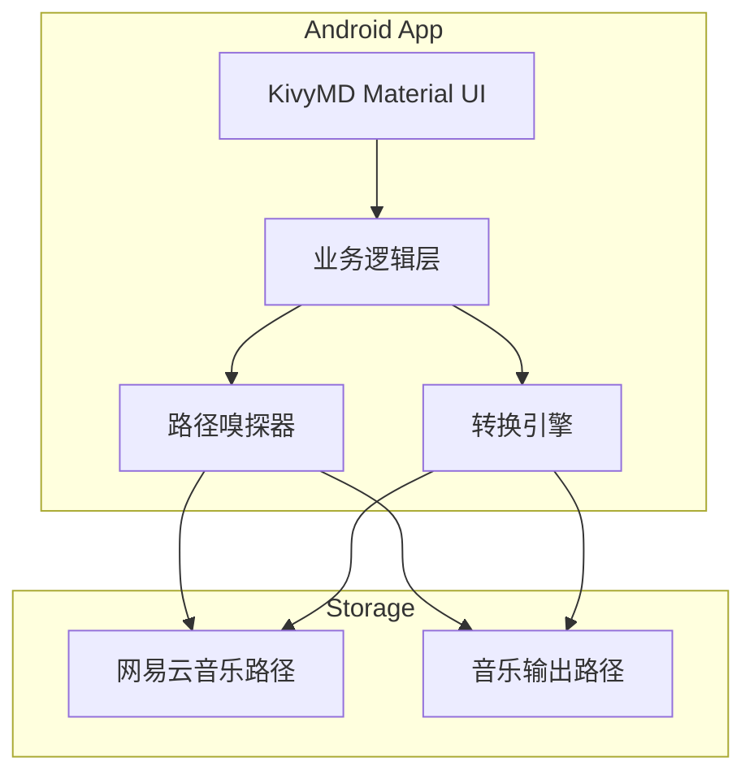
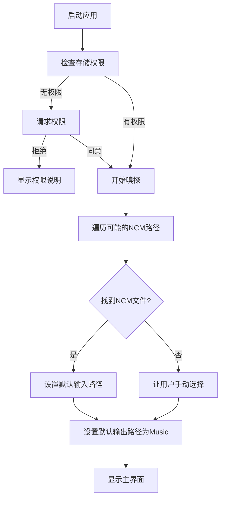
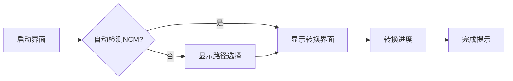

# NCM Converter 安卓版移植规划

## 项目背景

当前项目是一个Python命令行工具，用于将网易云音乐的NCM格式音频文件转换为常见音频格式（MP3、FLAC等）。现在需要移植到安卓平台。

## 当前项目分析

### 技术栈
- **语言**: Python 3.6+
- **核心依赖**: `ncmdump==0.1.1`
- **界面**: 命令行（CLI）
- **平台**: Windows

### 核心功能
1. 批量转换NCM文件
2. 支持多种输出格式
3. 跳过已存在文件
4. 中英文界面

## 安卓版需求分析

### 用户核心需求
1. **自动嗅探路径** - 根据网易云音乐默认下载路径自动提供输入路径
2. **默认输出路径** - 使用安卓默认音乐路径作为输出
3. **简化操作** - 减少用户选择，一键转换

### 安卓平台路径分析

#### 网易云音乐默认下载路径
```
# 常见路径（可能因版本和设备而异）
/storage/emulated/0/netease/cloudmusic/Music/
/storage/emulated/0/Android/data/com.netease.cloudmusic/files/Music/
/sdcard/netease/cloudmusic/Music/
/sdcard/Music/网易云音乐/
```

#### 安卓默认音乐输出路径
```
/storage/emulated/0/Music/NCM_Converted/
/sdcard/Music/NCM_Converted/
```

## 技术选型方案

### 最终方案：Kivy + KivyMD + GitHub Actions打包

**选择理由**：
1. **轻量级本地环境** - 本地只需安装Python和Kivy进行开发测试
2. **云端打包** - 使用GitHub Actions自动打包APK
3. **Material Design** - 使用KivyMD组件库实现Material Design风格
4. **代码复用** - 最大程度复用现有Python代码和ncmdump库
5. **CI/CD友好** - 推送代码即可自动构建APK

### 技术栈详情

| 组件 | 技术 | 用途 |
|------|------|------|
| UI框架 | Kivy 2.2+ | 跨平台UI基础 |
| UI组件库 | KivyMD 1.1+ | Material Design风格组件 |
| 转换核心 | ncmdump 0.1.1 | NCM解密 |
| 打包方式 | GitHub Actions + Buildozer | 云端APK打包 |

## 系统架构设计



## 路径嗅探逻辑设计



### 路径嗅探实现

```python
# 网易云音乐可能的路径（按优先级排序）
NETEASE_PATHS = [
    '/storage/emulated/0/netease/cloudmusic/Music/',
    '/storage/emulated/0/Android/data/com.netease.cloudmusic/files/Music/',
    '/sdcard/netease/cloudmusic/Music/',
    '/storage/emulated/0/Music/网易云音乐/',
    '/sdcard/Music/网易云音乐/',
]

# 输出路径
OUTPUT_PATHS = [
    '/storage/emulated/0/Music/NCM_Converted/',
    '/sdcard/Music/NCM_Converted/',
]
```

## 用户界面设计

### 设计原则
1. **Material Design风格** - 使用KivyMD组件
2. **一键转换** - 检测到NCM文件后，显示转换按钮
3. **进度显示** - 显示当前转换进度和状态
4. **最少选择** - 只在必要时让用户选择路径

### 界面流程



### 主要界面元素

1. **顶部AppBar** - 显示应用标题和设置按钮
2. **输入路径卡片** - 显示检测到的NCM路径，可点击修改
3. **输出路径卡片** - 显示输出路径，可点击修改
4. **文件统计** - 显示检测到的NCM文件数量和总大小
5. **转换按钮** - Material Design风格的FAB按钮
6. **进度指示器** - 线性进度条 + 百分比文字
7. **日志区域** - 可展开的转换日志

### 界面草图

```
┌─────────────────────────────────────┐
│  ≡  NCM转换器            ⚙️        │  <- AppBar
├─────────────────────────────────────┤
│  ┌─────────────────────────────┐   │
│  │ 📁 输入路径                 │   │  <- 路径卡片
│  │ /storage/.../Music/         │   │
│  │ 发现 23 个NCM文件 (156MB)   │   │
│  └─────────────────────────────┘   │
│                                     │
│  ┌─────────────────────────────┐   │
│  │ 💾 输出路径                 │   │  <- 输出卡片
│  │ /storage/.../NCM_Converted/ │   │
│  └─────────────────────────────┘   │
│                                     │
│  ═══════════════════════════════   │  <- 进度条
│  正在转换: 12/23 (52%)              │
│                                     │
│  ┌─────────────────────────────┐   │
│  │ ✓ song1.mp3                 │   │  <- 日志区域
│  │ ✓ song2.flac                │   │
│  │ ▶ song3.mp3 转换中...       │   │
│  └─────────────────────────────┘   │
│                                     │
│                  ┌─────────┐        │
│                  │    ▶    │        │  <- FAB转换按钮
│                  └─────────┘        │
└─────────────────────────────────────┘
```

## 功能设计

### 保留功能
- ✅ 批量转换NCM文件
- ✅ 支持多种输出格式（MP3、FLAC）
- ✅ 跳过已存在文件
- ✅ 显示转换进度和统计信息
- ✅ 中文界面（安卓版主要面向国内用户）

### 移除/简化功能
- ❌ 命令行参数（改用图形界面）
- ❌ 英文界面（简化开发）
- ❌ `--about`功能（移至设置页面）
- ⚠️ 强制覆盖（改为设置选项，默认关闭）

### 新增功能
- 🆕 路径自动嗅探
- 🆕 后台转换服务
- 🆕 转换完成通知

## 文件结构规划

```
ncm_converter_android/
├── main.py                 # 应用入口
├── requirements.txt        # Python依赖
├── buildozer.spec          # Buildozer配置
├── .github/
│   └── workflows/
│       └── build.yml       # GitHub Actions配置
├── app/
│   ├── __init__.py
│   ├── main.py             # 主应用类
│   ├── converter.py        # 转换核心逻辑（复用PC版）
│   ├── path_sniffer.py     # 路径嗅探
│   └── utils.py            # 工具函数
├── ui/
│   ├── __init__.py
│   ├── screens/
│   │   ├── __init__.py
│   │   ├── main_screen.py  # 主界面
│   │   └── settings_screen.py # 设置界面
│   └── components/
│       ├── __init__.py
│       ├── path_card.py    # 路径选择卡片
│       └── progress_card.py # 进度显示卡片
└── assets/
    └── icon.png            # 应用图标
```

---

## 本地开发环境安装指南

### 前置要求
- Windows 10/11（64位）
- Python 3.8 - 3.11（推荐3.10）
- pip包管理器

### Windows安装步骤

#### 1. 安装Python（如已有可跳过）

从 https://www.python.org/downloads/ 下载并安装Python 3.10

安装时勾选 **"Add Python to PATH"**

#### 2. 创建虚拟环境（推荐）

```bash
# 创建虚拟环境
python -m venv venv

# 激活虚拟环境（CMD）
venv\Scripts\activate.bat

# 或使用PowerShell
venv\Scripts\Activate.ps1
```

#### 3. 安装Kivy和KivyMD（使用国内镜像加速）

```bash
# 使用清华镜像安装
pip install -i https://pypi.tuna.tsinghua.edu.cn/simple kivy[base]
pip install -i https://pypi.tuna.tsinghua.edu.cn/simple kivymd
pip install -i https://pypi.tuna.tsinghua.edu.cn/simple ncmdump==0.1.1
pip install -i https://pypi.tuna.tsinghua.edu.cn/simple plyer

# 或一次性安装
pip install -i https://pypi.tuna.tsinghua.edu.cn/simple kivy[base] kivymd ncmdump==0.1.1 plyer
```

#### 4. 验证安装

```bash
# 测试Kivy安装
python -c "import kivy; print(f'Kivy version: {kivy.__version__}')"

# 测试KivyMD安装
python -c "import kivymd; print(f'KivyMD version: {kivymd.__version__}')"
```

### 完整的requirements.txt

```
kivy[base]>=2.2.0
kivymd>=1.1.0
ncmdump==0.1.1
plyer>=2.1.0
```

### 运行测试

```bash
# 进入项目目录
cd ncm_converter_android

# 安装依赖
pip install -i https://pypi.tuna.tsinghua.edu.cn/simple -r requirements.txt

# 运行应用（桌面测试）
python main.py
```

---

## APK打包指南（GitHub Actions）

### 为什么使用GitHub Actions？

- 完全自动化，推送代码即可构建APK
- 无需本地配置复杂的Buildozer环境
- GitHub服务器在国内访问相对稳定
- 免费额度足够个人项目使用

### 第一步：创建GitHub仓库

1. 访问 https://github.com/new
2. 创建新仓库（如 NCM_Converter_Android）
3. 上传项目代码

### 第二步：GitHub Actions自动构建

推送代码到main分支后，GitHub Actions会自动开始构建：

1. 点击仓库的 **Actions** 标签
2. 等待构建完成（绿色勾）
3. 点击 **Build APK** workflow
4. 在 **Artifacts** 区域下载 `NCM-Converter-APK.zip`
5. 解压得到APK文件

### GitHub Actions配置文件

创建文件 `.github/workflows/build.yml`：

```yaml
name: Build APK

on:
  push:
    branches: [ main ]
  pull_request:
    branches: [ main ]
  workflow_dispatch:  # 允许手动触发

jobs:
  build:
    runs-on: ubuntu-latest
    steps:
      - name: Checkout code
        uses: actions/checkout@v4
      
      - name: Set up Python 3.10
        uses: actions/setup-python@v5
        with:
          python-version: '3.10'
      
      - name: Install dependencies
        run: |
          pip install buildozer
          pip install cython
      
      - name: Build APK
        run: |
          buildozer android debug
      
      - name: Upload APK
        uses: actions/upload-artifact@v4
        with:
          name: NCM-Converter-APK
          path: bin/*.apk
```

### buildozer.spec配置示例

```ini
[app]
title = NCM转换器
package.name = ncmconverter
package.domain = org.example
source.dir = .
source.include_exts = py,png,jpg,kv,atlas
version = 1.0.0
requirements = python3,kivy,kivymd,ncmdump,plyer
orientation = portrait
fullscreen = 0
android.permissions = READ_EXTERNAL_STORAGE,WRITE_EXTERNAL_STORAGE,MANAGE_EXTERNAL_STORAGE
android.api = 31
android.minapi = 21
android.ndk = 25b
android.accept_sdk_license = True

[buildozer]
log_level = 2
warn_on_root = 1
```

---

## 首次构建注意事项

### 首次构建时间较长

首次运行GitHub Actions时，Buildozer需要下载：
- Android SDK
- Android NDK
- Python for Android

构建时间可能需要15-30分钟，这是正常的。

### 后续构建加速

Buildozer会缓存下载的依赖，后续构建会快很多（通常5-10分钟）。

可以使用GitHub Actions缓存进一步加速：

```yaml
- name: Cache Buildozer
  uses: actions/cache@v4
  with:
    path: |
      ~/.buildozer
      .buildozer
    key: ${{ runner.os }}-buildozer-${{ hashFiles('buildozer.spec') }}
    restore-keys: |
      ${{ runner.os }}-buildozer-
```

---

## 开发任务清单

### 第一阶段：环境搭建
- [ ] 安装Python 3.10
- [ ] 安装Kivy和KivyMD
- [ ] 验证开发环境

### 第二阶段：项目初始化
- [ ] 创建项目目录结构
- [ ] 创建requirements.txt
- [ ] 创建buildozer.spec
- [ ] 创建GitHub Actions workflow
- [ ] 创建基础main.py

### 第三阶段：核心功能移植
- [ ] 移植转换逻辑到app/converter.py
- [ ] 实现路径嗅探功能
- [ ] 实现权限请求逻辑
- [ ] 测试转换功能

### 第四阶段：UI开发
- [ ] 创建主界面布局
- [ ] 实现路径选择卡片组件
- [ ] 实现进度显示组件
- [ ] 实现日志显示组件
- [ ] 创建设置界面

### 第五阶段：安卓适配
- [ ] 测试安卓权限
- [ ] 适配Android 10+分区存储
- [ ] 处理应用生命周期

### 第六阶段：打包与测试
- [ ] 推送到GitHub触发构建
- [ ] 下载测试APK
- [ ] 真机测试
- [ ] 性能优化

### 第七阶段：发布
- [ ] 准备应用图标
- [ ] 打包正式版APK
- [ ] 编写用户说明

---

## 注意事项

### Android权限需求

```xml
<!-- 存储权限 -->
<uses-permission android:name="android.permission.READ_EXTERNAL_STORAGE"/>
<uses-permission android:name="android.permission.WRITE_EXTERNAL_STORAGE"/>

<!-- Android 11+ 需要管理所有文件权限 -->
<uses-permission android:name="android.permission.MANAGE_EXTERNAL_STORAGE"/>
```

### Android 10+ 分区存储

- Android 10引入了分区存储（Scoped Storage）
- Android 11+需要MANAGE_EXTERNAL_STORAGE权限访问非应用专属目录
- 需要特殊处理才能访问其他应用的数据目录

### 性能考虑

- 大文件转换可能耗时，建议显示进度
- 考虑使用后台服务进行转换
- 注意内存管理，避免同时处理过多文件

---

## 下一步行动

1. **立即开始**：创建项目基础结构
2. **核心开发**：实现路径嗅探和转换功能
3. **UI开发**：使用KivyMD创建Material Design界面
4. **云端打包**：推送GitHub自动构建APK
